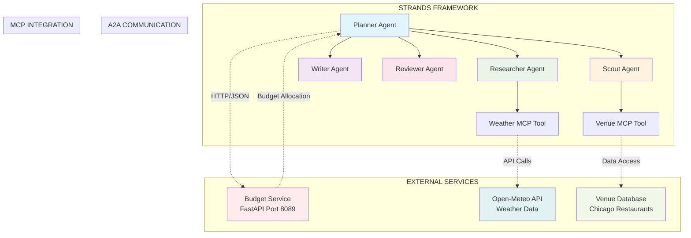
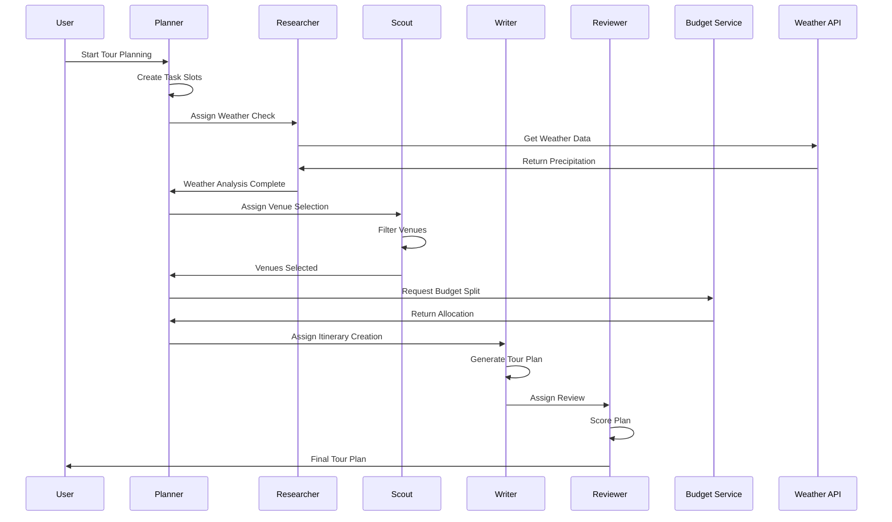
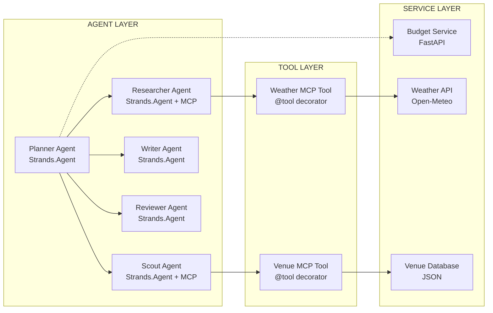
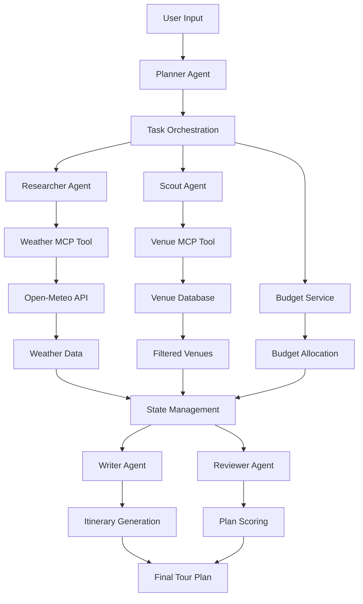

# 🍽️ Foodie Agents - Multi-Agent AI System

> **AI-powered food recommendation and restaurant discovery using the Strands framework**

[](https://strandsagents.com)
[](https://python.org)
[](LICENSE)
[]()

## 🎯 Overview

Foodie Agents is a **production-ready multi-agent AI system** that creates personalized food tours using the [Strands framework](https://strandsagents.com). The system demonstrates advanced AI concepts including **Agent-to-Agent (A2A) communication**, **Model Context Protocol (MCP) tools**, and **real-time reasoning analysis**.

### **Key Features**
- 🧠 **5 Specialized Agents**: Planner, Researcher, Scout, Writer, Reviewer
- 🌤️ **Weather-Adaptive Planning**: Real-time weather integration via MCP
- 🏪 **Smart Venue Selection**: AI-powered restaurant filtering
- 💰 **Budget Optimization**: Intelligent cost allocation with A2A communication
- 📊 **Real-Time Analysis**: Live decision tracking and reasoning insights
- 🚀 **Production Ready**: Built on Strands framework with enterprise features

---

## 🏗️ Architecture Overview

### **System Architecture Diagram**



### **Agent Workflow**



---

## 🔧 Core Concepts Implementation

### **1. Strands Framework Integration**

This project demonstrates **real Strands framework usage** (v1.5.0), not just compatibility:

```python
from strands import Agent
from strands.tools import tool

class PlannerAgent(Agent):
    """Planner agent using Strands Agent base class."""
    
    async def run(self, state: FoodieState, context: Any = None) -> FoodieState:
        # Strands async execution pattern
        return state
```

**Strands Benefits Implemented:**
- ✅ **Production-Ready Agents**: Built-in observability, error handling, scalability
- ✅ **Async Execution**: Modern Python async/await patterns
- ✅ **State Management**: Efficient dataclass-based state handling
- ✅ **Tool Integration**: Native MCP tool support
- ✅ **Multi-Agent Orchestration**: Built-in A2A communication patterns

### **2. Agent-to-Agent (A2A) Communication**

**A2A Pattern**: Different agent systems communicating via standard protocols

```python
def call_budget_service(budget_per_person: float, stops: int) -> Dict[str, Any]:
    """A2A communication with external budget service."""
    try:
        response = requests.post(
            "http://localhost:8089/budget",  # External agent service
            json={"budget_per_person": budget_per_person, "stops": stops},
            timeout=5
        )
        return response.json()
    except Exception:
        # Fallback to local logic
        return local_budget_fallback(budget_per_person, stops)
```

**A2A Architecture:**
- **Foodie Agents** (Strands Framework) ↔ **Budget Service** (FastAPI)
- **Protocol**: HTTP/JSON REST API
- **Error Handling**: Robust fallback mechanisms
- **Timeout Management**: 5-second request timeouts
- **State Propagation**: Seamless data flow between systems

### **3. Model Context Protocol (MCP) Tools**

**MCP Tools**: Standardized tool interfaces for agent capabilities

```python
@tool(name="weather_tool", description="Get weather data for tour planning")
def get_weather(date: str) -> Dict[str, Any]:
    """MCP-compliant weather tool using Open-Meteo API."""
    url = "https://api.open-meteo.com/v1/forecast"
    params = {
        "latitude": 41.8781,  # Chicago
        "longitude": -87.6298,
        "daily": "precipitation_probability_max",
        "timezone": "America/Chicago"
    }
    
    response = requests.get(url, params=params, timeout=10)
    data = response.json()
    
    precip_prob = data["daily"]["precipitation_probability_max"][0]
    return {
        "precip_prob": precip_prob,
        "condition": "rain" if precip_prob >= 50 else "clear",
        "indoor_required": precip_prob >= 50
    }
```

**MCP Benefits:**
- ✅ **Standardized Interface**: Consistent tool definitions
- ✅ **Interoperability**: Tools can be used across different agent systems
- ✅ **Documentation**: Automatic API specification generation
- ✅ **Validation**: Built-in input/output validation
- ✅ **Error Handling**: Standardized error reporting

---

## 🚀 Quick Start

### **Prerequisites**
- Python 3.11+
- Docker and Docker Compose
- Ollama (for local LLM inference)
- Langfuse Cloud account (free tier)

### **1. Setup Environment**

```bash
# Clone repository
git clone <repository-url>
cd strands-foodie-agents

# Install dependencies
make setup

# Start Postgres database
make obs-up
```

### **2. Configure Services**

```bash
# Copy environment template
cp .env.example .env

# Update with your Langfuse Cloud credentials
# Get from: https://cloud.langfuse.com
LANGFUSE_PUBLIC_KEY=your_public_key
LANGFUSE_SECRET_KEY=your_secret_key
```

### **3. Start Budget Service**

```bash
# Terminal 1: Start budget service
make run-budget-agent

# Terminal 2: Test the service
curl -X POST "http://localhost:8089/budget" \
  -H "Content-Type: application/json" \
  -d '{"budget_per_person": 100, "stops": 3}'
```

### **4. Run the Application**

```bash
# Basic tour planning
make run

# With real-time reasoning analysis
make analyze

# Custom parameters
python -m foodie_agents.run_foodie \
  --city Chicago \
  --budget 150 \
  --vibe cozy \
  --date 2025-08-23 \
  --analyze
```

---

## 📊 Available Commands

### **Makefile Targets**

| Target | Description |
|--------|-------------|
| `setup` | Install dependencies and setup environment |
| `run` | Run the main foodie agents application |
| `analyze` | Run with real-time reasoning analysis |
| `run-budget-agent` | Start the budget service on port 8089 |
| `lint` | Run linting with ruff |
| `format` | Format code with black |
| `obs-up` | Start Postgres database |
| `obs-down` | Stop Postgres database |
| `clean` | Clean up generated files |
| `status` | Show Postgres status and logs |

### **Command Line Options**

```bash
python -m foodie_agents.run_foodie [OPTIONS]

Options:
  --date TEXT     Tour date (YYYY-MM-DD) [default: 2025-08-23]
  --budget FLOAT  Budget per person [default: 100.0]
  --vibe TEXT     Tour vibe preference (cozy|lively) [default: cozy]
  --city TEXT     City for tour [default: Chicago]
  --analyze       Show real-time reasoning analysis
  --help          Show this message and exit
```

---

## 🧠 Real-Time Reasoning Analysis

The `--analyze` flag provides **deep insights into agent decision-making**:

### **Decision Pattern Analysis**
- Shows **WHY** agents chose specific approaches
- Identifies **consistent decision-making patterns**
- Tracks **decision frequency and types**

### **Confidence Distribution**
- Categorizes decisions by **confidence levels** (High/Medium/Low)
- Shows how **certain agents are** about their choices
- Identifies **potential areas of uncertainty**

### **Decision Quality Assessment**
- Rates each agent's **reasoning quality** (Excellent/Good/Needs Improvement)
- Evaluates **criteria completeness** and **evidence strength**
- Provides **actionable feedback** for improvement

### **Individual Agent Insights**
- Explains **WHY each agent made their decisions**
- Shows **criteria, evidence, and confidence** for each choice
- Tracks **next actions** and **workflow progression**

---

## 🏗️ Technical Architecture

### **Core Files Structure**

```
foodie_agents/
├── __init__.py                    # Package initialization
├── run_foodie.py                  # Main application runner
├── strands_agents.py              # All agents and MCP tools
├── reasoning_analyzer.py          # Real-time decision analysis
├── data/
│   ├── __init__.py
│   └── chicago_venues.json       # Curated venue database
└── interop/
    ├── __init__.py
    ├── budget_agent.py           # A2A budget service
    └── client.py                 # HTTP communication
```

### **Agent Architecture**



### **Data Flow Architecture**



---

## 🔍 Sample Analysis Report

See `sample_analysis_report.md` for a comprehensive example of the reasoning analysis output, including:

- **Execution Summary** with performance metrics
- **Decision Pattern Analysis** showing agent reasoning
- **Confidence Distribution** across all decisions
- **Individual Agent Performance** scores
- **Technical Architecture** documentation
- **Business Metrics** and recommendations

---

## 🌟 Key Benefits

### **Strands Framework Benefits**
- 🚀 **Production Ready**: Built-in observability, error handling, scalability
- 🧠 **Advanced Reasoning**: Built-in reasoning engines and state management
- 🛠️ **Developer Experience**: Type-safe agents, automatic documentation, testing utilities
- 🌐 **Ecosystem Integration**: Langfuse, multiple LLM providers, standard tool interfaces

### **A2A Communication Benefits**
- 🔗 **Interoperability**: Different agent systems can communicate seamlessly
- 📡 **Protocol Standards**: HTTP/JSON for universal compatibility
- 🛡️ **Error Resilience**: Robust fallback mechanisms
- ⚡ **Performance**: Efficient communication patterns

### **MCP Tools Benefits**
- 🔧 **Standardized Interface**: Consistent tool definitions across systems
- 📚 **Documentation**: Automatic API specification generation
- ✅ **Validation**: Built-in input/output validation
- 🔄 **Reusability**: Tools can be shared across different agent systems

---

## 🧪 Testing

### **End-to-End Testing**

```bash
# Test the full workflow with reasoning analysis
python -m foodie_agents.run_foodie --city Chicago --budget 100 --vibe cozy --analyze

# Or use the shortcut
make analyze

# Test budget service
make run-budget-agent
# Then in another terminal:
curl -X POST "http://localhost:8089/budget" \
  -H "Content-Type: application/json" \
  -d '{"budget_per_person": 100, "stops": 3}'
```

### **Component Testing**

```bash
# Test individual agents
python -c "from foodie_agents.strands_agents import PlannerAgent; print('Planner Agent loaded successfully')"

# Test MCP tools
python -c "from foodie_agents.strands_agents import get_weather; print('Weather MCP tool loaded successfully')"
```

---

## 🚀 Deployment

### **Production Deployment**

This system is **production-ready** and can be deployed to:

- **AWS Lambda**: Serverless execution
- **Docker Containers**: Containerized deployment
- **Kubernetes**: Scalable orchestration
- **Cloud Functions**: Platform-agnostic deployment

### **Environment Variables**

```bash
# Required
LANGFUSE_HOST=https://us.cloud.langfuse.com
LANGFUSE_PUBLIC_KEY=your_public_key
LANGFUSE_SECRET_KEY=your_secret_key

# Optional
CITY=Chicago
OLLAMA_MODEL=llama3:latest
```

---

## 🤝 Contributing

1. Fork the repository
2. Create a feature branch (`git checkout -b feature/amazing-feature`)
3. Commit your changes (`git commit -m 'Add amazing feature'`)
4. Push to the branch (`git push origin feature/amazing-feature`)
5. Open a Pull Request

### **Development Setup**

```bash
# Install development dependencies
pip install -e ".[dev]"

# Run linting
make lint

# Format code
make format

# Run tests
make test
```

---

## 📚 Documentation

- **Strands Framework**: [https://strandsagents.com](https://strandsagents.com)
- **MCP Specification**: [Model Context Protocol](https://modelcontextprotocol.io)
- **Open-Meteo API**: [Weather Data](https://open-meteo.com)
- **FastAPI**: [Web Framework](https://fastapi.tiangolo.com)

---

## 📄 License

This project is licensed under the MIT License - see the [LICENSE](LICENSE) file for details.

---

## 🙏 Acknowledgments

- **Strands Team** for the excellent multi-agent framework
- **Open-Meteo** for free weather data
- **FastAPI** for the modern web framework
- **OpenAI** for inspiring the multi-agent approach

---

**Built with ❤️ using the Strands Framework**
