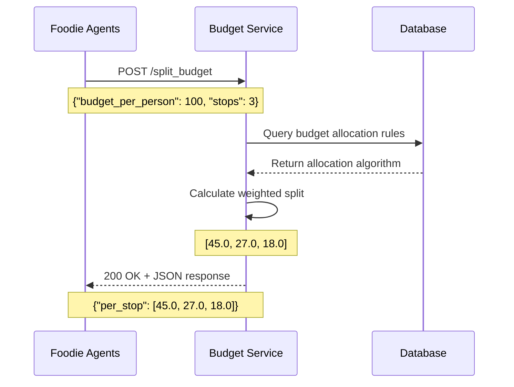

# Agent-to-Agent (A2A) Communication Patterns

> **Comprehensive guide to how A2A communication is implemented and utilized in the Foodie Agents system**

## Table of Contents

1. [Overview](#overview)
2. [A2A Architecture](#a2a-architecture)
3. [Communication Patterns](#communication-patterns)
4. [Data Flow](#data-flow)
5. [Agent Coordination](#agent-coordination)
6. [Error Handling & Fallbacks](#error-handling--fallbacks)
7. [Correlation & Tracing](#correlation--tracing)
8. [Best Practices](#best-practices)

## Overview

**Agent-to-Agent (A2A) communication** in Foodie Agents enables different agent systems to communicate via standard protocols, creating a **distributed, scalable architecture** where specialized services can interact seamlessly.

### **Key Benefits:**
- **Service Decoupling** - Agents can be developed and deployed independently
- **Scalability** - Services can scale horizontally based on demand
- **Technology Diversity** - Different services can use different tech stacks
- **Fault Isolation** - Failures in one service don't cascade to others
- **Standardized Interfaces** - Consistent communication patterns across services

## A2A Architecture

### **System Architecture**

```
┌─────────────────────────────────────────────────────────────────┐
│                    FOODIE AGENTS SYSTEM                        │
│                    (Strands Framework)                         │
├─────────────────────────────────────────────────────────────────┤
│  ┌─────────────┐  ┌─────────────┐  ┌─────────────┐            │
│  │   Planner   │  │ Researcher  │  │    Scout    │            │
│  │   Agent     │  │   Agent     │  │    Agent    │            │
│  └─────────────┘  └─────────────┘  └─────────────┘            │
│         │                │                │                   │
│         └────────────────┼────────────────┘                   │
│                          │                                    │
│  ┌─────────────┐  ┌─────────────┐  ┌─────────────┐            │
│  │   Budget    │  │   Writer    │  │  Reviewer   │            │
│  │   Agent     │  │   Agent     │  │   Agent     │            │
│  └─────────────┘  └─────────────┘  └─────────────┘            │
└─────────────────────────────────────────────────────────────────┘
                                │
                                │ A2A Communication
                                │ (Strands Framework)
                                ▼
┌─────────────────────────────────────────────────────────────────┐
│                    EXTERNAL SERVICES                            │
├─────────────────────────────────────────────────────────────────┤
│  ┌─────────────────────────────────────────────────────────┐   │
│  │              Budget Service (FastAPI)                   │   │
│  │              Port: 8001                                 │   │
│  │              Endpoint: /split_budget                    │   │
│  └─────────────────────────────────────────────────────────┘   │
│                                                               │
│  ┌─────────────────────────────────────────────────────────┐   │
│  │              Weather API (Open-Meteo)                   │   │
│  │              Endpoint: /v1/forecast                     │   │
│  └─────────────────────────────────────────────────────────┘   │
│                                                               │
│  ┌─────────────────────────────────────────────────────────┐   │
│  │              Venue Database (Local JSON)                │   │
│  │              File: chicago_venues.json                  │   │
│  └─────────────────────────────────────────────────────────┘   │
└─────────────────────────────────────────────────────────────────┘
```

### **Communication Layers**

1. **Internal Communication** - Strands agents within the same system
2. **A2A Communication** - HTTP/JSON communication with external services
3. **API Integration** - Third-party service integration (weather, venues)

## Communication Patterns

### **1. Synchronous Request-Response**

```python
# Budget Agent making A2A call to external budget service
def call_budget_service(budget: float, stops: int) -> Dict[str, Any]:
    """A2A communication with external budget service."""
    try:
        response = requests.post(
            f"{config.url}/split_budget",
            json={"budget_per_person": budget, "stops": stops},
            timeout=config.timeout
        )
        response.raise_for_status()
        return response.json()
    except Exception as e:
        # Fallback to local logic
        return split_budget(budget, stops)
```

**Pattern Characteristics:**
- **Blocking calls** - Wait for response before continuing
- **Timeout handling** - Prevent indefinite waiting
- **Error fallbacks** - Local logic when external service fails
- **JSON payloads** - Structured data exchange

### **2. Asynchronous Communication**

```python
# Future enhancement: Async A2A communication
async def call_budget_service_async(budget: float, stops: int) -> Dict[str, Any]:
    """Async A2A communication with external budget service."""
    async with aiohttp.ClientSession() as session:
        async with session.post(
            f"{config.url}/split_budget",
            json={"budget_per_person": budget, "stops": stops},
            timeout=aiohttp.ClientTimeout(total=config.timeout)
        ) as response:
            if response.status == 200:
                return await response.json()
            else:
                # Fallback to local logic
                return split_budget(budget, stops)
```

**Pattern Benefits:**
- **Non-blocking** - Other operations can continue
- **Better resource utilization** - Efficient I/O handling
- **Scalability** - Handle multiple concurrent requests
- **Performance** - Reduced overall execution time

### **3. Event-Driven Communication**

```python
# Future enhancement: Event-driven A2A patterns
class BudgetServiceEvent:
    """Event structure for budget service communication."""
    
    def __init__(self, budget: float, stops: int, correlation_id: str):
        self.budget = budget
        self.stops = stops
        self.correlation_id = correlation_id
        self.timestamp = datetime.now()
        self.event_type = "budget_split_request"

# Event publishing
async def publish_budget_request(event: BudgetServiceEvent):
    """Publish budget request event for A2A communication."""
    # Could use Redis, RabbitMQ, or other message brokers
    await message_broker.publish("budget_requests", event)
```

## Data Flow

### **Request Flow**



### **Response Flow**

```python
# A2A response handling in Foodie Agents
class BudgetAgent(Agent):
    async def run(self, state: FoodieState, context: Any = None) -> FoodieState:
        try:
            # A2A call to external service
            budget_response = call_budget_service(
                budget=state.budget,
                stops=len(state.shortlist)
            )
            
            # Extract and validate response
            if budget_response.get("per_stop"):
                state.budget_split = budget_response["per_stop"]
                self._log_success(budget_response)
            else:
                # Handle invalid response
                state.budget_split = self._fallback_split(state.budget, len(state.shortlist))
                self._log_fallback("Invalid response format")
                
        except Exception as e:
            # Fallback to local logic
            state.budget_split = self._fallback_split(state.budget, len(state.shortlist))
            self._log_error(str(e))
        
        return state
```

## Agent Coordination

### **1. Planner Agent Orchestration**

```python
# Planner agent coordinates other agents via A2A patterns
class PlannerLLMAgent(Agent):
    async def run(self, state: FoodieState, context: Any = None, planner_span_id: str = None) -> FoodieState:
        """Orchestrate the entire workflow using A2A communication."""
        
        # Step 1: Weather check (Researcher Agent)
        weather_result = await self._execute_researcher_agent(state)
        state.weather = weather_result
        
        # Step 2: Venue scouting (Scout Agent)
        venues_result = await self._execute_scout_agent(state)
        state.shortlist = venues_result
        
        # Step 3: Budget allocation (Budget Agent via A2A)
        budget_result = await self._execute_budget_agent(state)
        state.budget_split = budget_result
        
        # Step 4: Content writing (Writer Agent)
        content_result = await self._execute_writer_agent(state)
        state.itinerary = content_result
        
        # Step 5: Quality review (Reviewer Agent)
        review_result = await self._execute_reviewer_agent(state)
        state.review_score = review_result
        
        return state
    
    async def _execute_budget_agent(self, state: FoodieState) -> List[float]:
        """Execute budget agent with A2A communication."""
        try:
            # A2A call to external budget service
            budget_response = call_budget_service(
                budget=state.budget,
                stops=len(state.shortlist)
            )
            
            if budget_response.get("per_stop"):
                return budget_response["per_stop"]
            else:
                # Fallback to local logic
                return self._local_budget_split(state.budget, len(state.shortlist))
                
        except Exception as e:
            # Fallback to local logic
            return self._local_budget_split(state.budget, len(state.shortlist))
```

### **2. Agent State Sharing**

```python
# Agents share state through structured data flow
class FoodieState:
    """Shared state for A2A communication between agents."""
    
    def __init__(self):
        self.city: str = "Chicago"
        self.vibe: str = "cozy"
        self.budget: float = 100.0
        self.date: str = None
        self.weather: Dict[str, Any] = {}
        self.shortlist: List[Dict[str, Any]] = []
        self.budget_split: List[float] = []
        self.itinerary: str = ""
        self.review_score: float = 0.0
        self.reasoning: List[Dict[str, Any]] = []

# State flow between agents
async def execute_agent_workflow():
    """Execute complete agent workflow with A2A communication."""
    
    # Initialize shared state
    state = FoodieState()
    
    # Planner orchestrates the workflow
    planner = PlannerLLMAgent()
    final_state = await planner.run(state)
    
    return final_state
```

### **3. Agent Dependency Management**

```python
# Agent dependencies managed through A2A communication
class AgentDependencyManager:
    """Manage agent dependencies and execution order."""
    
    def __init__(self):
        self.dependencies = {
            "check_weather": [],  # No dependencies
            "scout_venues": ["check_weather"],  # Depends on weather
            "split_budget": ["scout_venues"],   # Depends on venues
            "write_itinerary": ["split_budget"], # Depends on budget
            "review": ["write_itinerary"]       # Depends on content
        }
    
    def get_execution_order(self) -> List[str]:
        """Get topological sort of agent execution order."""
        # Implementation of topological sorting
        # Ensures dependencies are satisfied before execution
        pass
    
    def can_execute(self, agent_name: str, completed_steps: List[str]) -> bool:
        """Check if agent can execute based on dependencies."""
        required_deps = self.dependencies.get(agent_name, [])
        return all(dep in completed_steps for dep in required_deps)

# Usage in planner
dependency_manager = AgentDependencyManager()
execution_order = dependency_manager.get_execution_order()

for step in execution_order:
    if dependency_manager.can_execute(step, completed_steps):
        # Execute agent for this step
        result = await execute_agent_step(step, state)
        completed_steps.append(step)
        state = update_state(state, step, result)
```

## Error Handling & Fallbacks

### **1. Service Unavailability**

```python
# Comprehensive error handling for A2A communication
def call_budget_service_with_fallback(budget: float, stops: int) -> Dict[str, Any]:
    """A2A communication with robust fallback handling."""
    
    # Try external service first
    try:
        response = requests.post(
            f"{config.url}/split_budget",
            json={"budget_per_person": budget, "stops": stops},
            timeout=config.timeout
        )
        response.raise_for_status()
        return response.json()
        
    except requests.exceptions.Timeout:
        # Service is slow
        logger.warning("Budget service timeout, using local fallback")
        return local_budget_split(budget, stops)
        
    except requests.exceptions.ConnectionError:
        # Service is down
        logger.error("Budget service unavailable, using local fallback")
        return local_budget_split(budget, stops)
        
    except requests.exceptions.HTTPError as e:
        # Service error
        logger.error(f"Budget service error: {e.response.status_code}")
        return local_budget_split(budget, stops)
        
    except Exception as e:
        # Unexpected error
        logger.error(f"Unexpected error in budget service call: {e}")
        return local_budget_split(budget, stops)
```

### **2. Response Validation**

```python
# Validate A2A responses before using them
def validate_budget_response(response: Dict[str, Any]) -> bool:
    """Validate budget service response format."""
    required_fields = ["per_stop", "per_person_total"]
    
    # Check required fields exist
    if not all(field in response for field in required_fields):
        return False
    
    # Validate data types
    if not isinstance(response["per_stop"], list):
        return False
    
    if not isinstance(response["per_person_total"], (int, float)):
        return False
    
    # Validate business logic
    if sum(response["per_stop"]) > response["per_person_total"]:
        return False
    
    return True

# Usage in agent
def call_budget_service_safe(budget: float, stops: int) -> Dict[str, Any]:
    """Safe A2A communication with response validation."""
    try:
        response = call_budget_service(budget, stops)
        
        if validate_budget_response(response):
            return response
        else:
            logger.warning("Invalid budget service response, using fallback")
            return local_budget_split(budget, stops)
            
    except Exception as e:
        logger.error(f"Budget service call failed: {e}")
        return local_budget_split(budget, stops)
```

### **3. Circuit Breaker Pattern**

```python
# Circuit breaker for A2A service protection
class CircuitBreaker:
    """Circuit breaker pattern for A2A service protection."""
    
    def __init__(self, failure_threshold: int = 5, timeout: int = 60):
        self.failure_threshold = failure_threshold
        self.timeout = timeout
        self.failure_count = 0
        self.last_failure_time = None
        self.state = "CLOSED"  # CLOSED, OPEN, HALF_OPEN
    
    def call(self, func, *args, **kwargs):
        """Execute function with circuit breaker protection."""
        
        if self.state == "OPEN":
            if time.time() - self.last_failure_time > self.timeout:
                self.state = "HALF_OPEN"
            else:
                raise Exception("Circuit breaker is OPEN")
        
        try:
            result = func(*args, **kwargs)
            self._on_success()
            return result
            
        except Exception as e:
            self._on_failure()
            raise e
    
    def _on_success(self):
        """Handle successful call."""
        self.failure_count = 0
        self.state = "CLOSED"
    
    def _on_failure(self):
        """Handle failed call."""
        self.failure_count += 1
        self.last_failure_time = time.time()
        
        if self.failure_count >= self.failure_threshold:
            self.state = "OPEN"

# Usage in budget service calls
budget_circuit_breaker = CircuitBreaker(failure_threshold=3, timeout=30)

def call_budget_service_with_circuit_breaker(budget: float, stops: int) -> Dict[str, Any]:
    """A2A communication with circuit breaker protection."""
    try:
        return budget_circuit_breaker.call(
            call_budget_service, budget, stops
        )
    except Exception:
        return local_budget_split(budget, stops)
```

## Correlation & Tracing

### **1. Request Correlation**

```python
# Correlation IDs for A2A communication tracing
import uuid
from datetime import datetime

class A2ACorrelation:
    """Correlation tracking for A2A communication."""
    
    def __init__(self):
        self.correlation_id = str(uuid.uuid4())
        self.timestamp = datetime.now()
        self.service_name = "foodie_agents"
        self.operation = "budget_allocation"
    
    def to_headers(self) -> Dict[str, str]:
        """Convert correlation data to HTTP headers."""
        return {
            "X-Correlation-ID": self.correlation_id,
            "X-Request-Timestamp": self.timestamp.isoformat(),
            "X-Service-Name": self.service_name,
            "X-Operation": self.operation
        }

# Usage in A2A calls
def call_budget_service_with_correlation(budget: float, stops: int) -> Dict[str, Any]:
    """A2A communication with correlation tracking."""
    correlation = A2ACorrelation()
    
    try:
        response = requests.post(
            f"{config.url}/split_budget",
            json={"budget_per_person": budget, "stops": stops},
            headers=correlation.to_headers(),
            timeout=config.timeout
        )
        response.raise_for_status()
        
        # Log correlation for tracing
        logger.info(f"A2A call successful: {correlation.correlation_id}")
        return response.json()
        
    except Exception as e:
        # Log correlation for error tracing
        logger.error(f"A2A call failed: {correlation.correlation_id}, error: {e}")
        raise
```

### **2. Distributed Tracing**

```python
# OpenTelemetry integration for A2A tracing
from opentelemetry import trace
from opentelemetry.propagate import inject

def call_budget_service_with_tracing(budget: float, stops: int) -> Dict[str, Any]:
    """A2A communication with distributed tracing."""
    tracer = trace.get_tracer(__name__)
    
    with tracer.start_as_current_span("budget_service_call") as span:
        # Add span attributes
        span.set_attribute("a2a.service", "budget_service")
        span.set_attribute("a2a.operation", "split_budget")
        span.set_attribute("a2a.budget", budget)
        span.set_attribute("a2a.stops", stops)
        
        try:
            # Inject trace context into headers
            headers = {}
            inject(headers)
            
            response = requests.post(
                f"{config.url}/split_budget",
                json={"budget_per_person": budget, "stops": stops},
                headers=headers,
                timeout=config.timeout
            )
            response.raise_for_status()
            
            # Record successful response
            span.set_attribute("a2a.response_status", response.status_code)
            span.set_attribute("a2a.response_size", len(response.content))
            
            return response.json()
            
        except Exception as e:
            # Record error in span
            span.record_exception(e)
            span.set_attribute("a2a.error", str(e))
            raise
```

## Best Practices

### **1. Service Discovery**

```python
# Service discovery for A2A communication
class ServiceRegistry:
    """Service registry for A2A communication."""
    
    def __init__(self):
        self.services = {
            "budget": {
                "url": "http://localhost:8001",
                "health_check": "/health",
                "timeout": 5,
                "circuit_breaker": CircuitBreaker()
            },
            "weather": {
                "url": "https://api.open-meteo.com",
                "health_check": "/v1/forecast",
                "timeout": 10,
                "circuit_breaker": CircuitBreaker()
            }
        }
    
    def get_service_config(self, service_name: str) -> Dict[str, Any]:
        """Get service configuration for A2A communication."""
        if service_name not in self.services:
            raise ValueError(f"Unknown service: {service_name}")
        
        return self.services[service_name]
    
    def is_service_healthy(self, service_name: str) -> bool:
        """Check if A2A service is healthy."""
        config = self.get_service_config(service_name)
        
        try:
            response = requests.get(
                f"{config['url']}{config['health_check']}",
                timeout=2
            )
            return response.status_code == 200
        except Exception:
            return False

# Usage in agents
service_registry = ServiceRegistry()

def call_budget_service_with_discovery(budget: float, stops: int) -> Dict[str, Any]:
    """A2A communication with service discovery."""
    if not service_registry.is_service_healthy("budget"):
        logger.warning("Budget service unhealthy, using local fallback")
        return local_budget_split(budget, stops)
    
    config = service_registry.get_service_config("budget")
    return call_budget_service_with_circuit_breaker(budget, stops)
```

### **2. Retry Logic**

```python
# Retry logic for A2A communication
from tenacity import retry, stop_after_attempt, wait_exponential

@retry(
    stop=stop_after_attempt(3),
    wait=wait_exponential(multiplier=1, min=4, max=10)
)
def call_budget_service_with_retry(budget: float, stops: int) -> Dict[str, Any]:
    """A2A communication with exponential backoff retry."""
    response = requests.post(
        f"{config.url}/split_budget",
        json={"budget_per_person": budget, "stops": stops},
        timeout=config.timeout
    )
    response.raise_for_status()
    return response.json()
```

### **3. Rate Limiting**

```python
# Rate limiting for A2A communication
import time
from collections import deque

class RateLimiter:
    """Rate limiter for A2A communication."""
    
    def __init__(self, max_requests: int, time_window: int):
        self.max_requests = max_requests
        self.time_window = time_window
        self.requests = deque()
    
    def can_make_request(self) -> bool:
        """Check if A2A request can be made."""
        now = time.time()
        
        # Remove old requests outside time window
        while self.requests and self.requests[0] <= now - self.time_window:
            self.requests.popleft()
        
        # Check if under rate limit
        if len(self.requests) < self.max_requests:
            self.requests.append(now)
            return True
        
        return False

# Usage in budget service calls
budget_rate_limiter = RateLimiter(max_requests=10, time_window=60)

def call_budget_service_with_rate_limiting(budget: float, stops: int) -> Dict[str, Any]:
    """A2A communication with rate limiting."""
    if not budget_rate_limiter.can_make_request():
        logger.warning("Rate limit exceeded, using local fallback")
        return local_budget_split(budget, stops)
    
    return call_budget_service(budget, stops)
```

## Summary

**Agent-to-Agent (A2A) communication** in Foodie Agents provides:

### **Key Benefits:**
1. **Service Decoupling** - Independent development and deployment
2. **Scalability** - Horizontal scaling based on demand
3. **Technology Diversity** - Different tech stacks for different services
4. **Fault Isolation** - Failures don't cascade across services
5. **Standardized Interfaces** - Consistent communication patterns

### **Implementation Patterns:**
1. **Synchronous Request-Response** - Simple, blocking communication
2. **Asynchronous Communication** - Non-blocking, scalable operations
3. **Event-Driven Patterns** - Loose coupling with message brokers

### **Best Practices:**
1. **Comprehensive Error Handling** - Graceful degradation with fallbacks
2. **Response Validation** - Ensure data integrity
3. **Circuit Breaker Pattern** - Protect against cascading failures
4. **Correlation & Tracing** - End-to-end request tracking
5. **Service Discovery** - Dynamic service location
6. **Retry Logic** - Handle transient failures
7. **Rate Limiting** - Prevent service overload

### **Current A2A Services:**
1. **Budget Service** - FastAPI microservice for budget allocation
2. **Weather API** - Open-Meteo for real-time weather data
3. **Venue Database** - Local JSON with A2A expansion potential

The Foodie Agents system demonstrates **enterprise-grade A2A communication patterns** with robust error handling, comprehensive monitoring, and scalable architecture!
